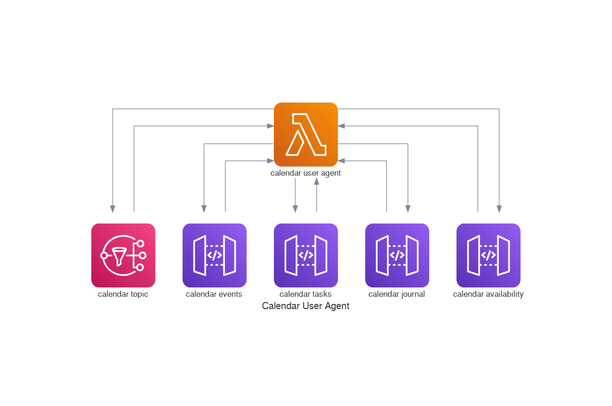

# Serverless Calendar User Agent (CUA)

The purpose of this function is to provide support for common calendar operations as defined in RFC5546.

## Introduction

There are many use-cases that require iCalendar support for managing workflows and business processes.

For example, you may want to publish calendar updates to a list of email or web subscribers.

Or perhaps you want to delegate meeting requests to a software defined workflow.

Maybe you even want to manage booking of resources such as meeting rooms.

These can all be achieved via iCalendar methods.

This function focuses specifically on calendar transformations that conform with iCalendar method specification.
The primary interface is an SNS topic whereby calendars are published for consumption via the CUA or some other
function. In this way much of the complexity of iCalendar is removed from the business logic that can focus
simply on calendar creation and response handling.




## Overview

The function supports subscription to an SNS topic that provides calendar information and operation metadata
as follows:

    {
        "method": "<method>",
        "calendar": "<content>"
    }

## Specification

### Methods

The following methods are supported by this function:

| Method         | Description                                           | Response                                                                                  | References |
|----------------|-------------------------------------------------------|-------------------------------------------------------------------------------------------|------------|
| PUBLISH        | Publish calendar information without confirmation     | Publish calendar information to configured targets (e.g. web, storage, subscribers, etc.) |            |
| REQUEST        | Request acceptance of a calendar invitation           | Sends a calendar request to attendees                                                     |            |
| REPLY          | Respond to a calendar invitation                      | Process a response for a calendar request and update calendar data accordingly            |            |
| ADD            | Add to an existing calendar invitation                | Sends an updated calendar invitation to attendees                                         |            |
| CANCEL         | Cancel an existing calendar invitation                | Sends a calendar invite cancellation to attendees                                         |            |
| REFRESH        | Request the latest calendar invitation from organizer | Process refresh request and send updated calendar to requestor (via email)                |            |
| COUNTER        | Request a change to a calendar invitation             | Process counter request and send updated calendar to attendees                            |            |
| DECLINECOUNTER | Reject a change to a calendar invitation              | Sends a rejection of invite changes to requestor (via email)                              |            |


### Component Types

The Component Type tells us which backing stores to interact with and/or information to publish.

The following tables indicates which methods are supported by each Component Type.

| Component Type        | PUBLISH | REQUEST | REPLY | ADD | CANCEL | REFRESH | COUNTER | DECLINECOUNTER | Comments                                                                           |
|-----------------------|---------|---------|-------|-----|--------|---------|---------|----------------|------------------------------------------------------------------------------------|
| calendar              | -       | Y       | Y     | Y   | Y      | Y       | Y       | -              | Used for processing incoming messages from external sources (e.g. via email, etc.) |
| event-calendar        | Y       | -       | -     | Y   | Y      | -       | -       | -              | Publish a group of events as a single calendar                                     |
| event                 | Y       | Y       | -     | Y   | Y      | -       | -       | Y              | Process updates to a single event managed internally                               |
| task-calendar         | Y       | -       | -     | -   | -      | -       | -       | -              | Publish a collection of tasks                                                      |
| task                  | Y       | Y       | -     | Y   | Y      | -       | -       | Y              | Process task updates                                                               |
| journal-calendar      | Y       | -       | -     | Y   | Y      | -       | -       | -              | Publish a collection of journal entries                                            |
| journal               | Y       | -       | -     | Y   | Y      | -       | -       | -              | Process updates to a journal entry                                                 |
| availability-calendar | Y       | -       | -     | -   | -      | -       | -       | -              | Publish a collection of availability times                                         |
| availability          | Y       | -       | -     | -   | -      | -       | -       | -              | Process updates to availability                                                    |


### Input events


The following input messages describe the expected structure of topic events for common use-cases.

#### Publish event calendar

Publishing may include a combination of updating content at a web location, sending via email to a list of subscribers,
or saving generated calendar information to storage (e.g. an S3 bucket, etc.).

```json
{
  "component-type": "event-calendar",
  "method": "PUBLISH",
  "calendar": "<calendar_uid>"
}
```

#### Send a meeting request

When a new event is created for a meeting an event request action may be generated.

```json
{
  "component-type": "event",
  "method": "REQUEST",
  "event": "<event_uid>"
}
```

We can also process externally generated events depending on the message payload.

```json
{
  "component-type": "calendar",
  "method": "REQUEST",
  "request": "<request_calendar_object>"
}
```

#### Process a meeting reply

When a response to a meeting request is received (via email, etc.) we can update the event information accordingly.

```json
{
  "component-type": "calendar",
  "method": "REPLY",
  "reply": "<reply_calendar_object>"
}
```
